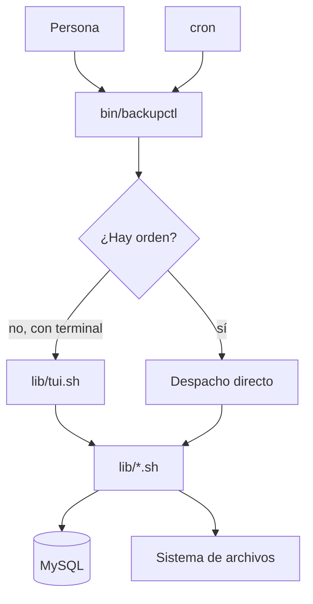

# Arquitectura

## Estructura

```
bin/backupctl          Despachador: opciones, perfil, orden. ~360 líneas
lib/                   Toda la lógica
├── core.sh            Registro, colores, errores, bloqueos, formato
├── config.sh          Descubrimiento y carga de perfiles, valores por defecto
├── mysql.sh           Conexión, inventario, primitivas de volcado, escapado
├── backup.sh          Orquestación del respaldo y manifiesto
├── verify.sh          Verificación en cuatro niveles
├── restore.sh         Restauración por segmentos
├── archive.sh         list, inspect, status
├── restic.sh          Claves Restic de HestiaCP
├── retention.sh       Retención y limpieza de huérfanos
├── notify.sh          Los tres canales de aviso
├── doctor.sh          Diagnóstico del entorno
├── cron.sh            Programación
├── logs.sh            Consulta de registros
├── deploy.sh          Instalación remota
├── migrate.sh         Migración entre servidores
└── tui.sh             Interfaz interactiva

config/env.sh.example  Referencia de configuración
docs/                  Esta documentación
<Perfil>/env.sh        Configuración de cada servidor
```

## Las dos compuertas, una lógica



La TUI **no reimplementa nada**: llama a `bc_backup_run`, `bc_verify_run`,
`bc_restore_run`… exactamente igual que la CLI. Lo que se prueba a mano es lo
que corre de madrugada.

## Convenios

**Prefijo `bc_`** en todo lo público, para no colisionar con las variables de
`env.sh`, que se cargan en el mismo espacio de nombres.

**Guarda de carga múltiple** al principio de cada módulo:

```bash
[[ -n "${BC_CORE_LOADED:-}" ]] && return 0
BC_CORE_LOADED=1
```

**Nada se ejecuta al cargar.** Los módulos solo definen funciones y constantes.
Cualquier cosa que dependa del perfil tiene que ser una función, no una variable
inicializada al vuelo — es lo que obligó a convertir `BC_CRON_MARK` en
`bc_cron_mark()`.

**Opciones por variables `BC_OPT_*`.** El despachador las rellena y los módulos
las leen. Así la TUI puede fijarlas antes de llamar a la misma función.

**`set -Eeuo pipefail`** se activa en `bin/backupctl`, no en los módulos, para
que se puedan cargar desde otros contextos.

## Manejo de errores

Tres traps en el despachador:

```bash
trap 'rc=$?; bc_cleanup_all; exit $rc' EXIT
trap 'BC_DELIBERATE_EXIT=1; bc_err "interrumpido por señal"; exit 130' INT TERM
trap '(( BC_DELIBERATE_EXIT )) || bc_err "fallo no controlado ..."' ERR
```

`BC_DELIBERATE_EXIT` distingue una salida decidida por nosotros (`bc_die`, un
`return 1` tras un resumen) de un fallo genuino. Sin esa marca, cada `exit 2`
controlado imprimiría además un «fallo no controlado» que confunde más de lo que
informa.

## Detalles que no son obvios

??? warning "Las tuberías crean subshells"
    Este patrón **pierde silenciosamente los contadores**:

    ```bash
    {
      while read -r x; do
        [[ ... ]] || bc_verify_fail "..."     # ← se pierde
        total=$(( total + 1 ))                 # ← se pierde
      done < <(find ...)
    } | bc_table
    ```

    El bloque entero corre en una subshell. Se manifestó como «0 bases de datos»
    en un respaldo con 81, y —mucho peor— habría hecho que una verificación
    fallida devolviera código 0.

    La forma correcta es acumular las filas en un archivo y formatear después:

    ```bash
    printf '...' >> "$rows_file"
    done < <(find ...)
    bc_table < "$rows_file"
    ```

??? warning "Separador decimal y locale"
    `awk` produce `38.3`; `printf` de bash en locale `es_ES` espera `38,3` y
    rechaza el valor. La solución es formatear **todo dentro de awk** con
    `LC_ALL=C`, en una sola llamada:

    ```bash
    LC_ALL=C awk -v b="$1" 'BEGIN{ printf "%.1fM", b/1048576 }'
    ```

??? warning "El menú de texto debe dibujarse en stderr"
    El llamador captura stdout con `$(...)` para leer la opción elegida. Si el
    menú saliera por stdout, se lo tragaría la sustitución de órdenes y la
    pantalla quedaría en blanco.

    Es el convenio de `whiptail`, y el modo texto lo respeta. Lo mismo vale para
    el prompt de `read`: `read -p` escribe en stderr por diseño, y añadirle
    `2>&1` mete el texto del prompt dentro del valor capturado.

??? warning "mysqldump miente con --force"
    Termina con código 0 aunque no haya podido volcar una tabla. Por eso
    `bc_dump_segment` captura stderr a un archivo y lo analiza. Es la razón de
    ser de todo el diseño de detección de errores.

## Añadir una orden nueva

1. Escribir `bc_mi_orden()` en el módulo que corresponda (o uno nuevo en `lib/`).
2. Si es un módulo nuevo, añadirlo a la lista de `source` de `bin/backupctl`.
3. Añadir el `case` en el despacho.
4. Documentarla en `bc_usage()`.
5. Si tiene sentido interactivamente, añadirla al menú de `lib/tui.sh`.
6. Documentarla en `docs/referencia/ordenes.md`.

## Comprobaciones

```bash
bash -n bin/backupctl lib/*.sh      # sintaxis
shellcheck bin/backupctl lib/*.sh   # análisis estático
backupctl doctor                    # entorno
backupctl --debug <orden> --dry-run # traza
```
