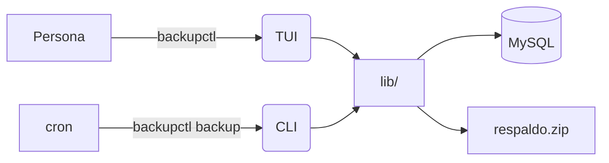
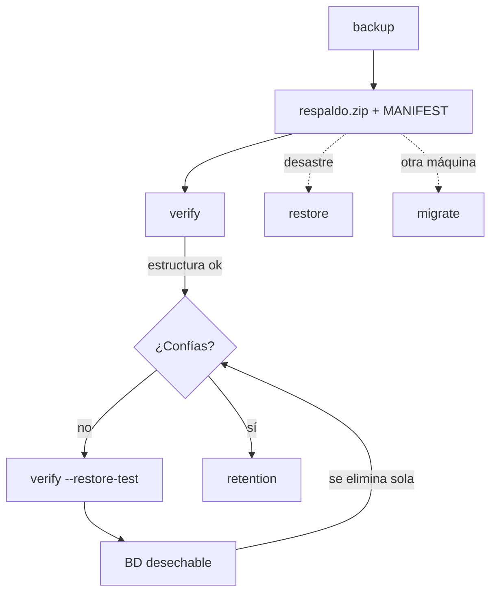

# Conceptos

Cuatro ideas bastan para entender todo el sistema.

## 1. Perfil

Un **perfil** es un servidor. En la práctica, un directorio con un `env.sh`
dentro.

```
TejidoTesting/
└── env.sh          ← todo lo que distingue a este servidor
```

El código de `backupctl` es **idéntico en todas las máquinas**. Lo único que
cambia entre servidores vive en su `env.sh`: rutas, credenciales, retención y
avisos. Por eso no hay copias del script por servidor que puedan divergir.

```bash
backupctl profiles                  # ver los perfiles disponibles
backupctl -p TejidoTesting status   # trabajar con uno concreto
```

Cada carpeta de servidor guarda tres cosas:

| Archivo | Quién lo escribe | Para qué |
|---|---|---|
| `env.sh` | **Tú** | La configuración de ese servidor |
| `NOTAS.md` | **Tú** | Particularidades del despliegue, para no repensarlas |
| `ESTADO.md` | `backupctl pull` | Foto de lo que hay realmente en la máquina |

Y hay dos sentidos entre el repositorio y el servidor:

```bash
backupctl -p TejidoTesting deploy root@servidor   # SUBIR código + config
backupctl -p TejidoTesting pull   root@servidor   # DESCARGAR el estado real
```

!!! note "El perfil `local`"
    Cuando `backupctl` está instalado **en** un servidor, su `env.sh` queda
    junto al tooling y el perfil se llama `local`. Como es el único, no hace
    falta indicarlo: `backupctl backup` a secas ya sabe cuál usar.

??? info "Dónde se buscan los perfiles"
    En este orden:

    1. `$BC_ROOT/env.sh` → instalación en un servidor (perfil `local`)
    2. `$BC_ROOT/servers/*/env.sh`
    3. `$BC_ROOT/*/env.sh` → disposición del repositorio

    Se ignoran los directorios internos: `bin`, `lib`, `docs`, `config`, `site`.

## 2. Segmentos

Cada base de datos no se vuelca en un único `.sql`, sino en **seis archivos**:

| Archivo | Contiene | Para qué sirve por separado |
|---|---|---|
| `database.sql` | `CREATE DATABASE` con charset y collation exactos | Recrear la base con la codificación correcta |
| `tables.sql` | Estructura de las tablas | Levantar el esquema sin datos |
| `data.sql` | Solo las filas | Recargar datos sobre un esquema existente |
| `views.sql` | Definiciones de vistas | Rehacer vistas sin tocar tablas |
| `functions.sql` | Funciones y procedimientos | Restaurar rutinas tras un cambio |
| `others.sql` | Triggers y eventos | Revisarlos aparte |

El troceado no es capricho: es lo que permite **restaurar solo lo que hace
falta**. Recuperar unas vistas que alguien rompió no debería obligarte a
restaurar 40 MB de datos.

```bash
# Solo la estructura, sin tocar los datos que ya están en producción
backupctl restore '' tienda --segments tables,views
```

## 3. Las dos compuertas



Ambas entradas llaman a las **mismas funciones**. No hay una versión
"interactiva" y otra "automática" que puedan comportarse distinto: lo que
pruebas a mano es lo que se ejecuta de noche.

## 4. El ciclo completo



!!! warning "El paso que casi nadie da"
    Casi todo el mundo hace `backup`. Muy poca gente hace `verify --restore-test`.
    Es el único paso que demuestra que el respaldo **sirve**, y por eso existe
    una orden dedicada. Ver [Verificar](../operacion/verificar.md).

## Vocabulario rápido

Manifiesto
:   Archivo `MANIFEST.txt` dentro del zip con metadatos, inventario y sumas
    SHA-256 de todo lo que contiene. Permite inspeccionar y validar un respaldo
    sin extraerlo entero.

Segmento
:   Cada uno de los seis archivos en que se trocea una base de datos.

DEFINER
:   Cláusula que MySQL añade a vistas, rutinas y triggers indicando qué usuario
    los creó. Es el principal obstáculo para restaurar en otra máquina, y por
    eso `backupctl` la elimina. Ver [Portabilidad](../migracion/portabilidad.md).

Base de datos desechable
:   La que crea `verify --restore-test` para probar la restauración. Se llama
    `verifybk_<marca de tiempo>` y **se elimina siempre** al terminar.
