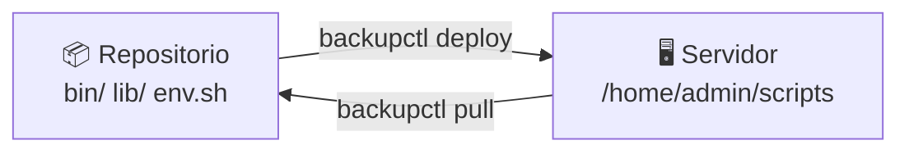

# Qué es cada cosa

!!! tip "Si solo lees una página, que sea esta"
    Hay 17 archivos de código en el repositorio. **Tú tocas uno.** El resto no
    se edita nunca a mano.

## El repositorio en un vistazo

```
📦 repositorio
│
├── 🔧 bin/backupctl        LA ORDEN. Se sube a todos los servidores.
├── 🔧 lib/*.sh             La lógica. Se sube a todos los servidores.
│                           ↑ estos son "los archivos compartidos con
│                             cualquier otro despliegue"
│
├── 📖 docs/                Esta documentación
├── 📖 mkdocs.yml           Configuración de la documentación
├── 📖 config/env.sh.example  Plantilla de configuración
│
└── 🖥️ MiVPS/       UN SERVIDOR
    ├── ✏️ env.sh           ← LO ÚNICO QUE EDITAS TÚ
    ├── ✏️ NOTAS.md         ← tus apuntes. Nadie los toca
    ├── 🤖 ESTADO.md        ← lo genera `backupctl pull`. No editar
    ├── 📂 logs/            ← salidas locales, si has ejecutado aquí
    └── 📂 output/          ← respaldos locales
```

| Símbolo | Significado |
|---|---|
| ✏️ | **Lo editas tú** |
| 🔧 | Código compartido. Se sube igual a todos los servidores |
| 🤖 | Se genera solo |
| 📖 | Documentación |

## La regla

!!! success "Solo hay una cosa distinta entre un servidor y otro: su `env.sh`"
    El código es **byte a byte idéntico** en todas las máquinas. Por eso no hay
    copias por servidor que puedan divergir, y por eso desplegar es copiar dos
    directorios y un archivo.

## Un servidor = una carpeta

Cada servidor tiene su carpeta en la raíz del repositorio:

```
MiVPS/       ← un servidor
OtroCliente/         ← otro servidor
```

Dentro de cada una:

| Archivo | Quién lo escribe | Para qué |
|---|---|---|
| `env.sh` | **Tú** | Credenciales, rutas, retención y avisos de ESE servidor |
| `NOTAS.md` | **Tú** | Particularidades del despliegue, para no volver a pensarlas |
| `ESTADO.md` | `backupctl pull` | Foto de lo que hay realmente en la máquina |

## Los dos sentidos



=== "SUBIR — `deploy`"

    ```bash
    backupctl -p MiVPS deploy root@servidor
    ```

    Lleva `bin/`, `lib/` y el `env.sh` de ese perfil al servidor. Es lo que
    haces cuando cambias algo en el repo y quieres que llegue a la máquina.

    Los respaldos y logs del servidor **no se tocan**.

=== "DESCARGAR — `pull`"

    ```bash
    backupctl -p MiVPS pull root@servidor
    ```

    Trae al repositorio lo que hay realmente allí: compara el `env.sh` del
    servidor con el tuyo y te avisa si difieren, y escribe `ESTADO.md` con la
    versión instalada, el crontab, los respaldos y el diagnóstico.

    Es lo que hace que el repositorio **recuerde** cada despliegue.

## Qué acaba en el servidor

```
/home/admin/scripts/
├── bin/backupctl      ← copiado del repo (igual en todos los servidores)
├── lib/*.sh           ← copiado del repo (igual en todos los servidores)
├── env.sh             ← copiado de MiVPS/env.sh
├── logs/              ← se genera allí
└── output/            ← se genera allí (los respaldos viven aquí)
```

Allí los scripts **viven y corren**: el cron los ejecuta de madrugada y tú
puedes entrar por SSH y lanzarlos a mano.

```bash
ssh root@servidor
/home/admin/scripts/bin/backupctl status     # sin -p: allí solo hay un perfil
```

!!! note "Por qué en el servidor no hace falta `-p`"
    Allí el `env.sh` está junto al código, así que solo existe un perfil y se
    llama `local`. En el repositorio, en cambio, hay varias carpetas de
    servidor, y por eso hay que decir con cuál trabajas.

## Los tres archivos que importan

Si te pierdes, vuelve a esto:

| Quiero… | Archivo / orden |
|---|---|
| Cambiar la configuración de un servidor | `MiVPS/env.sh` |
| Apuntar algo del despliegue | `MiVPS/NOTAS.md` |
| Saber qué hay ahora mismo en el servidor | `MiVPS/ESTADO.md` (o `backupctl pull`) |
| Cambiar cómo funciona el respaldo | `lib/backup.sh` **y luego `deploy` a todos** |

## Ciclo típico de trabajo

```bash
# 1. Ver qué hay realmente en el servidor
backupctl -p MiVPS pull root@servidor

# 2. Ajustar algo
backupctl -p MiVPS config --edit      # abre MiVPS/env.sh

# 3. Subirlo
backupctl -p MiVPS deploy root@servidor

# 4. Comprobar allí
ssh root@servidor '/home/admin/scripts/bin/backupctl doctor'
```

## Añadir un servidor nuevo

```bash
mkdir MiServidor
cp config/env.sh.example MiServidor/env.sh
${EDITOR:-nano} MiServidor/env.sh              # credenciales y DEPLOY_HOST

backupctl profiles                             # debería aparecer
backupctl -p MiServidor deploy root@nuevo
backupctl -p MiServidor pull root@nuevo       # ESTADO.md y NOTAS.md
```

Nada más. No hay plantillas que copiar ni scripts que duplicar.
