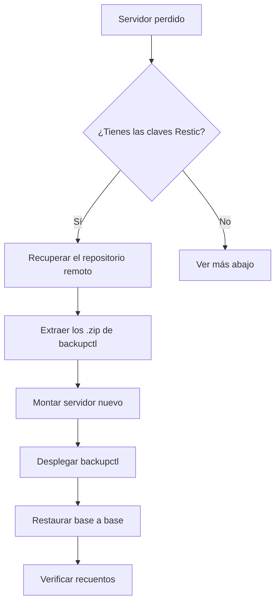

# Recuperación ante desastre

Qué hacer cuando ya ha pasado. Lee esto **antes** de necesitarlo.

## Primero: no toques nada

!!! danger "Regla número uno"
    Si has perdido datos, **deja de escribir en ese servidor**. Cada minuto de
    actividad hace más difícil la recuperación y puede sobrescribir lo que aún
    se podía salvar.

    ```bash
    systemctl stop apache2 nginx        # parar la aplicación
    ```

## Escenario 1 — Se borró una tabla o unos datos

**El servidor está bien.** Es el caso más común y el más fácil.

```bash
# 1. ¿Qué respaldos tengo y de cuándo?
backupctl list

# 2. Restaurar AL LADO, nunca encima
backupctl restore '' tienda --into tienda_recuperada

# 3. Comparar y extraer lo que falta
mysql -e "SELECT COUNT(*) FROM tienda.pedidos;"
mysql -e "SELECT COUNT(*) FROM tienda_recuperada.pedidos;"
```

```sql
INSERT INTO tienda.pedidos
SELECT * FROM tienda_recuperada.pedidos
WHERE id NOT IN (SELECT id FROM tienda.pedidos);
```

```bash
# 4. Limpiar
mysql -e "DROP DATABASE tienda_recuperada;"
```

!!! tip "Por qué `--into` y no restaurar encima"
    Restaurar encima destruye lo que quedaba, que puede ser más reciente que el
    respaldo. Restaurar al lado te deja decidir con las dos versiones delante.

## Escenario 2 — Una base de datos entera corrupta

```bash
backupctl verify --restore-test tienda --with-data    # 1. ¿el respaldo sirve?
mysqldump tienda | gzip > /tmp/tienda_rota.sql.gz     # 2. guardar lo roto, por si acaso
mysql -e "DROP DATABASE tienda;"                      # 3. limpiar
backupctl restore '' tienda                           # 4. restaurar
```

El paso 1 no es opcional: comprueba que el respaldo sirve **antes** de borrar
nada.

## Escenario 3 — El servidor entero se perdió

Aquí es donde importa haber tenido las copias **fuera de la máquina**.



**Pasos:**

```bash
# 1. Recuperar del repositorio Restic (necesitas su clave)
restic -r rclone:destino:ruta snapshots
restic -r rclone:destino:ruta restore latest --target /recuperacion

# 2. Localizar los respaldos de backupctl
ls /recuperacion/home/admin/scripts/output/mysql_backups/

# 3. Montar el servidor nuevo, instalar MySQL y HestiaCP

# 4. Desplegar backupctl y restaurar
backupctl deploy admin@nuevo.example
scp all_databases_XXXX.zip admin@nuevo.example:/home/admin/scripts/output/mysql_backups/

ssh admin@nuevo.example
cd /home/admin/scripts
./bin/backupctl verify all_databases_XXXX.zip        # ANTES de restaurar
./bin/backupctl list --databases all_databases_XXXX.zip

for db in $(./bin/backupctl list --databases all_databases_XXXX.zip); do
    ./bin/backupctl restore all_databases_XXXX.zip "$db" --yes
done
```

!!! danger "Si no tienes las claves de Restic"
    Sin ellas el repositorio remoto es ilegible. Por eso existe
    `backupctl restic`, y por eso ese archivo debe estar **también fuera del
    servidor**: en un gestor de contraseñas o en otra máquina.

    Es la dependencia circular clásica de los sistemas de respaldo: la clave
    para recuperar el respaldo estaba en la máquina que perdiste.

## Escenario 4 — El respaldo también está roto

```bash
# Probar los anteriores, del más reciente al más antiguo
for z in $(ls -t output/mysql_backups/*.zip); do
    echo "=== $z ==="
    backupctl verify "$z" --quick && echo "ESTE SIRVE" && break
done
```

Si un `.zip` está parcialmente dañado, aún se puede rescatar lo que quede:

```bash
unzip -o all_databases_XXXX.zip 2>&1 | grep -v 'error'   # extraer lo posible
find . -name '*.gz' -exec gzip -t {} \; 2>&1              # ver qué sobrevivió
```

Cada `.gz` es independiente: un archivo corrupto no invalida los demás. Ese es
uno de los motivos del troceado.

## Lo que un respaldo de bases de datos NO cubre

| Qué falta | Dónde está |
|---|---|
| Archivos de la aplicación (`/home/user/web/`) | Restic / HestiaCP |
| Usuarios y privilegios de MySQL | Hay que recrearlos |
| Configuración del servidor (`my.cnf`, vhosts) | Restic / HestiaCP |
| Certificados TLS | Se regeneran con Let's Encrypt |
| Correo | Restic / HestiaCP |

Para recrear los usuarios de MySQL, si aún tienes acceso al origen:

```sql
SELECT CONCAT('SHOW GRANTS FOR ''',user,'''@''',host,''';')
FROM mysql.user WHERE user NOT IN ('root','mysql.sys','mysql.session');
```

## Ensayo anual

!!! quote "Un plan de recuperación que nunca se ha ensayado no es un plan: es una esperanza."

Una vez al año, en una máquina desechable:

- [ ] Recuperar un respaldo del repositorio Restic remoto.
- [ ] Desplegar `backupctl` en una máquina limpia.
- [ ] Restaurar **todas** las bases de datos.
- [ ] Comprobar que los recuentos cuadran.
- [ ] Levantar la aplicación contra la base restaurada.
- [ ] Anotar cuánto tardó todo.

Ese último punto es el más valioso: hasta que no lo mides, tu tiempo de
recuperación es una suposición.

## Ficha rápida

```bash
backupctl list                                  # qué tengo
backupctl verify <zip>                          # ¿sirve?
backupctl restore <zip> <bd> --into <bd>_rec    # restaurar al lado
backupctl restore <zip> <bd>                    # restaurar encima
backupctl list --databases <zip>                # qué contiene
```

**Datos que conviene tener escritos en otro sitio:**

- Dónde está el repositorio Restic y cuál es su clave.
- Credenciales del proveedor de almacenamiento remoto.
- Qué bases de datos son críticas y en qué orden levantarlas.
- Contacto de quien puede dar de alta un servidor nuevo.
