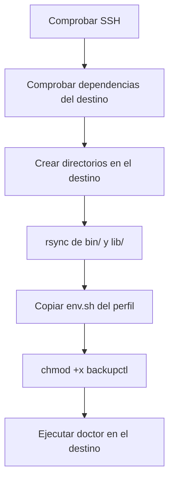

# Desplegar en otro servidor

```bash
backupctl deploy root@servidor.example
```

Copia `bin/` y `lib/` más el `env.sh` del perfil, y ejecuta el diagnóstico en el
destino.

## Requisitos

- Un usuario que pueda entrar por SSH. **Vale con contraseña**: se pide una sola
  vez para todo el despliegue. Con clave no la pide nunca:
  ```bash
  ssh-copy-id root@servidor.example      # opcional, pero cómodo
  ```
- `rsync` en tu equipo. En el servidor, si falta, `deploy` se ofrece a
  instalarlo.

!!! tip "El usuario que conecta no tiene que ser el propietario"
    En HestiaCP muchos usuarios se crean con `nologin`. No hay que darles shell:
    conéctate con uno que sí la tenga y declara en `env.sh` de quién es la
    instalación.

    ```bash
    export DEPLOY_USER="root"      # quien se conecta; los usuarios del panel no tienen consola      # quién se conecta
    export USER_NAME="cliente07"    # de quién es la instalación
    ```

    `deploy` crea los directorios (con `sudo` si hace falta) y ajusta el
    propietario al final.

## Ensayo primero

```bash
backupctl deploy root@servidor.example --dry-run
```

Muestra exactamente qué archivos se copiarían, sin tocar nada.

## Comprobación previa de dependencias

Antes de copiar nada, `deploy` comprueba por SSH que el servidor tiene lo que
hace falta. Una instalación mínima de Debian/Ubuntu **no trae `zip` ni
`rsync`**.

```
[INFO ] Comprobando las dependencias del servidor...
[  OK ] todas las dependencias están presentes en el servidor.
```

Si falta algo, **se ofrece a instalarlo**:

```
[AVISO] faltan órdenes en el servidor: rsync zip
¿Instalarlas ahora en el servidor (apt install rsync zip)? [S/n]
[  OK ] paquetes instalados.
```

Si prefieres hacerlo tú, te da la línea exacta con los nombres de **paquete**
(no de orden: el paquete de `find` se llama `findutils`). Sin `rsync` se aborta,
porque es imprescindible para la propia copia.

## Qué hace



```
== Despliegue en root@servidor.example:/home/admin/scripts ==
[INFO ] Comprobando acceso SSH...
[  OK ] conectado a servidor.example
[INFO ]   GNU bash, version 5.2.21(1)-release
[INFO ] Se copiarán: bin lib + env.sh del perfil 'TejidoTesting'
¿Copiar backupctl a root@servidor.example:/home/admin/scripts? [S/n]
[INFO ] Copiando el tooling...
[INFO ] Copiando la configuración del perfil 'TejidoTesting'...
[  OK ] Desplegado en root@servidor.example:/home/admin/scripts

== Diagnóstico en el destino ==
    ✓ mysql  (/usr/bin/mysql)
    ...
[  OK ] El destino está listo.
```

## El perfil en el destino

El `env.sh` queda **junto al tooling**, así que allí el perfil se llama `local`
y es el único. No hace falta indicarlo:

```bash
ssh root@servidor.example
/home/admin/scripts/bin/backupctl status      # sin -p
```

!!! warning "Revisa el env.sh en el destino"
    Se copia tal cual el del perfil de origen. Si el servidor nuevo tiene otras
    credenciales de MySQL, otras rutas o distinto destino de avisos, edítalo
    allí:

    ```bash
    ssh root@servidor.example '/home/admin/scripts/bin/backupctl config --edit'
    ```

## Cambiar la ruta de destino

```bash
backupctl deploy root@servidor.example --path /opt/backupctl
```

Por defecto se usa `DEPLOY_PATH` del perfil (`/home/$USER_NAME/scripts`).

## Actualizar una instalación existente

La misma orden. `rsync --delete` deja `bin/` y `lib/` exactamente como el
origen, y `output/` y `logs/` quedan excluidos, así que **no se pierde ningún
respaldo**.

```bash
backupctl deploy root@servidor.example
```

## Después de desplegar

```bash
ssh root@servidor.example
cd /home/admin/scripts

./bin/backupctl doctor                          # 1. sin fallos
./bin/backupctl backup                          # 2. primer respaldo
./bin/backupctl verify --restore-test <bd>      # 3. la prueba de verdad
./bin/backupctl cron --install                  # 4. programarlo
```

## Predefinir el destino

En `env.sh`:

```bash
export DEPLOY_HOST="servidor.example"
export DEPLOY_USER="root"      # quien se conecta; los usuarios del panel no tienen consola
export DEPLOY_PATH="/home/admin/scripts"
```

Con eso, `backupctl deploy` sin argumentos ya sabe adónde ir.
