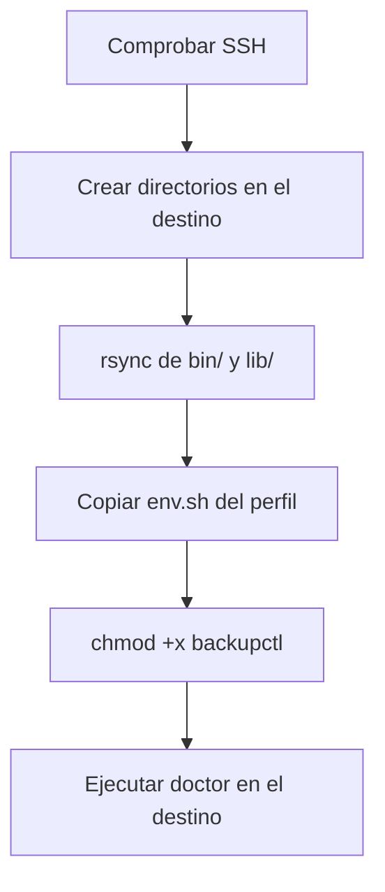

# Desplegar en otro servidor

```bash
backupctl deploy admin@servidor.example
```

Copia `bin/` y `lib/` más el `env.sh` del perfil, y ejecuta el diagnóstico en el
destino.

## Requisitos

- Acceso SSH **por clave** (sin contraseña interactiva):
  ```bash
  ssh-copy-id admin@servidor.example
  ```
- `rsync` en ambos extremos.

## Ensayo primero

```bash
backupctl deploy admin@servidor.example --dry-run
```

Muestra exactamente qué archivos se copiarían, sin tocar nada.

## Qué hace



```
== Despliegue en admin@servidor.example:/home/admin/scripts ==
[INFO ] Comprobando acceso SSH...
[  OK ] conectado a servidor.example
[INFO ]   GNU bash, version 5.2.21(1)-release
[INFO ] Se copiarán: bin lib + env.sh del perfil 'TejidoTesting'
¿Copiar backupctl a admin@servidor.example:/home/admin/scripts? [S/n]
[INFO ] Copiando el tooling...
[INFO ] Copiando la configuración del perfil 'TejidoTesting'...
[  OK ] Desplegado en admin@servidor.example:/home/admin/scripts

== Diagnóstico en el destino ==
    ✓ mysql  (/usr/bin/mysql)
    ...
[  OK ] El destino está listo.
```

## El perfil en el destino

El `env.sh` queda **junto al tooling**, así que allí el perfil se llama `local`
y es el único. No hace falta indicarlo:

```bash
ssh admin@servidor.example
/home/admin/scripts/bin/backupctl status      # sin -p
```

!!! warning "Revisa el env.sh en el destino"
    Se copia tal cual el del perfil de origen. Si el servidor nuevo tiene otras
    credenciales de MySQL, otras rutas o distinto destino de avisos, edítalo
    allí:

    ```bash
    ssh admin@servidor.example '/home/admin/scripts/bin/backupctl config --edit'
    ```

## Cambiar la ruta de destino

```bash
backupctl deploy admin@servidor.example --path /opt/backupctl
```

Por defecto se usa `DEPLOY_PATH` del perfil (`/home/$USER_NAME/scripts`).

## Actualizar una instalación existente

La misma orden. `rsync --delete` deja `bin/` y `lib/` exactamente como el
origen, y `output/` y `logs/` quedan excluidos, así que **no se pierde ningún
respaldo**.

```bash
backupctl deploy admin@servidor.example
```

## Después de desplegar

```bash
ssh admin@servidor.example
cd /home/admin/scripts

./bin/backupctl doctor                          # 1. sin fallos
./bin/backupctl backup                          # 2. primer respaldo
./bin/backupctl verify --restore-test <bd>      # 3. la prueba de verdad
./bin/backupctl cron --install                  # 4. programarlo
```

## Predefinir el destino

En `env.sh`:

```bash
export DEPLOY_HOST="servidor.example"
export DEPLOY_USER="admin"
export DEPLOY_PATH="/home/admin/scripts"
```

Con eso, `backupctl deploy` sin argumentos ya sabe adónde ir.
