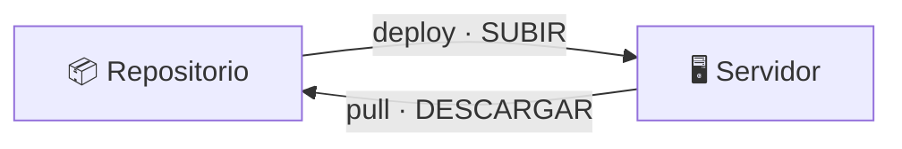

# Subir y descargar

Los dos sentidos entre el repositorio y un servidor.



| Orden | Sentido | Qué mueve |
|---|---|---|
| `deploy` | repo → servidor | `bin/`, `lib/` y el `env.sh` del perfil |
| `pull` | servidor → repo | El `env.sh` real y una foto del estado (`ESTADO.md`) |

Ninguna de las dos toca los respaldos ni los logs del servidor.

---

## `pull` — descargar el estado real

```bash
backupctl -p TejidoTesting pull admin@servidor
backupctl -p TejidoTesting pull                 # si DEPLOY_HOST está definido
```

Es lo que hace que el repositorio sirva **para recordar** qué hay desplegado en
cada máquina, sin tener que conectarse a mirarlo.

### Qué hace

1. **Compara el `env.sh`.** Si el del servidor difiere del tuyo, muestra el
   `diff` y te pregunta cuál conservar:

    ```
    [AVISO] el env.sh del SERVIDOR difiere del que hay en el repositorio:

        --- repositorio: TejidoTesting/env.sh
        +++ servidor:    admin@servidor:/home/admin/scripts/env.sh
        -export BACKUP_RETENTION_DAYS="14"
        +export BACKUP_RETENTION_DAYS="30"

    ¿Traer la versión del SERVIDOR al repositorio (sobrescribe la local)? [s/N]
    ```

    Esto detecta el caso clásico: alguien —tú, hace meses— ajustó algo
    directamente en la máquina y el repositorio se quedó desactualizado.

    Si aceptas, la versión anterior se guarda como `env.sh.anterior`. Si no, se
    conserva la local y **la diferencia queda anotada en `ESTADO.md`**.

2. **Escribe `ESTADO.md`** en la carpeta del servidor, con:

    - servidor, acceso SSH y ruta del despliegue
    - versión de `backupctl` instalada
    - número de bases de datos
    - crontab instalado, tal cual
    - espacio en disco
    - contenido del directorio de despliegue
    - salida de `status`, `list` y `doctor`

3. **Crea `NOTAS.md`** si no existe, con una plantilla vacía.

### Los tres archivos por servidor

```
TejidoTesting/
├── env.sh          ✏️  lo editas tú          → se sube con deploy
├── NOTAS.md        ✏️  lo escribes tú        → pull NUNCA lo toca
└── ESTADO.md       🤖  lo genera pull        → se regenera entero cada vez
```

!!! warning "`ESTADO.md` se regenera entero"
    No escribas nada ahí: el siguiente `pull` lo borra. Tus apuntes van en
    `NOTAS.md`, que es tuyo y nunca se sobrescribe.

### Ensayo

```bash
backupctl -p TejidoTesting pull admin@servidor --dry-run
```

Se conecta y enseña las diferencias, pero no escribe nada.

### Sin backupctl en el servidor

Funciona igual, con menos información:

```
[AVISO] no hay backupctl en admin@servidor:/home/admin/scripts. Se recogerá lo que se pueda.
[AVISO] Para desplegarlo: backupctl -p TejidoTesting deploy admin@servidor
```

Recoge el `env.sh`, el crontab, el disco y el contenido del directorio. Útil
para inventariar un servidor antes de modernizarlo.

---

## `deploy` — subir

Documentado en detalle en [Desplegar en otro servidor](desplegar.md).

```bash
backupctl -p TejidoTesting deploy admin@servidor
backupctl -p TejidoTesting deploy admin@servidor --dry-run
```

---

## Ciclo de trabajo

```bash
# 1. ¿Qué hay ahora mismo allí?
backupctl -p TejidoTesting pull admin@servidor

# 2. Ajustar la configuración en el repositorio
backupctl -p TejidoTesting config --edit

# 3. Subirlo
backupctl -p TejidoTesting deploy admin@servidor

# 4. Confirmar
ssh admin@servidor '/home/admin/scripts/bin/backupctl doctor'

# 5. Dejar constancia en el repositorio
backupctl -p TejidoTesting pull admin@servidor
```

Los pasos 1 y 5 son los que mantienen el repositorio sincronizado con la
realidad.

## Revisar todos los servidores de golpe

```bash
for p in $(backupctl profiles | tail -n +3 | awk '{print $1}'); do
    printf '=== %s ===\n' "$p"
    backupctl -p "$p" pull
done
git diff --stat        # qué cambió en los ESTADO.md desde la última vez
```

!!! tip "El `git diff` es la parte útil"
    Si `ESTADO.md` cambia entre dos recogidas, algo se movió en el servidor: se
    actualizó la versión, cambió el crontab, hay menos respaldos o el
    diagnóstico empeoró. El repositorio pasa a ser el historial de tus
    despliegues.

## Actualizar todos los servidores tras un cambio de código

```bash
# Cambias algo en lib/
for p in $(backupctl profiles | tail -n +3 | awk '{print $1}'); do
    backupctl -p "$p" deploy
done
```

Como el código es idéntico en todas las máquinas, esto es seguro: no hay
variantes por servidor que puedan quedarse atrás.
