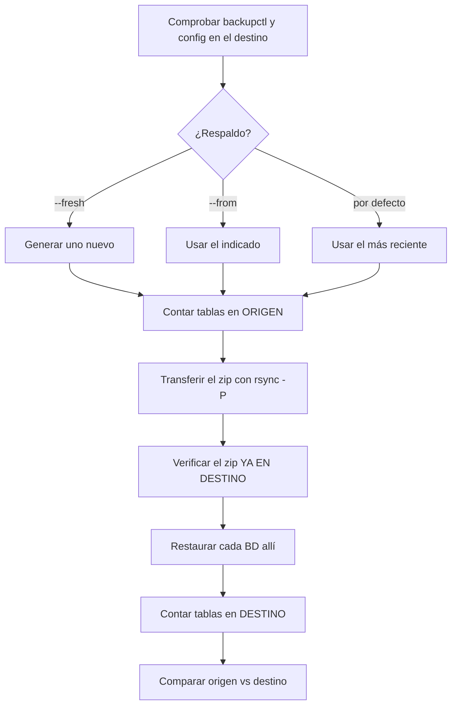

# Migrar bases de datos

Llevar las bases de datos de este servidor a otro, con comprobación.

```bash
backupctl migrate --to root@nuevo.example --fresh
```

## Antes de empezar

1. **Desplegar `backupctl` en el destino**:
   ```bash
   backupctl deploy root@nuevo.example
   ```
2. Comprobar que allí funciona:
   ```bash
   ssh root@nuevo.example '/home/admin/scripts/bin/backupctl doctor'
   ```

`migrate` se niega a empezar si el destino no tiene un `backupctl` operativo.

## Ensayo

```bash
backupctl migrate --to root@nuevo.example --dry-run
```

Comprueba conectividad, configuración del destino y lista qué se migraría, sin
escribir nada.

## Qué hace



El paso de comparación es el que convierte «he copiado un archivo» en «la
migración es correcta».

```
== Comprobación ==
BASE DE DATOS  ORIGEN  DESTINO  RESULTADO
tienda         41      41       ok
blog           22      22       ok
catalogo       18      12       DIFIERE

[INFO ] Restauradas: 3. Con fallos: 0. Recuentos que no cuadran: 1.
[ERROR] La migración terminó con incidencias.
```

## Opciones

| Opción | Efecto |
|---|---|
| `--to usuario@host` | Destino (o `DEPLOY_HOST` del perfil) |
| `--fresh` | Generar un respaldo nuevo antes de migrar |
| `--from <zip>` | Usar un respaldo concreto |
| `--databases a,b` | Solo esas bases de datos |
| `--prefix <pre>` | Restaurar con prefijo en el destino |
| `--path <ruta>` | Ruta de `backupctl` en el destino |
| `--dry-run` | Ensayo |

### `--fresh`

Sin él se usa el respaldo más reciente que haya, y se avisa si es viejo:

```
[AVISO] tiene 3 días: los cambios posteriores NO se migrarán. Usa --fresh para uno nuevo.
```

Para una migración real casi siempre quieres `--fresh`.

### `--prefix`

```bash
backupctl migrate --to root@nuevo.example --prefix nuevo_
```

`tienda` se restaura como `nuevo_tienda`. Sirve para migrar a un servidor que
**ya tiene** bases con esos nombres, sin pisarlas.

## Verificación en tránsito

El zip se verifica **después de llegar al destino**, antes de restaurar nada:

```
[INFO ] Verificando el archivo en el destino...
[  OK ] El archivo llegó íntegro.
```

Una transferencia corrupta que se restaura es peor que una que falla. La
transferencia usa `rsync -azP`, así que es reanudable si se corta.

## Migración completa recomendada

```bash
# 1. Preparar el destino
backupctl deploy root@nuevo.example
ssh root@nuevo.example '/home/admin/scripts/bin/backupctl doctor'

# 2. Ensayo
backupctl migrate --to root@nuevo.example --dry-run

# 3. Migración real con datos de ahora mismo
backupctl migrate --to root@nuevo.example --fresh

# 4. Comprobar en el destino
ssh root@nuevo.example
cd /home/admin/scripts
./bin/backupctl backup
./bin/backupctl verify --restore-test tienda --with-data
./bin/backupctl cron --install
```

!!! danger "Lo que la migración NO lleva"
    - **Usuarios y privilegios de MySQL**: hay que recrearlos en el destino.
      ```sql
      -- En el ORIGEN, para ver qué recrear
      SELECT CONCAT('SHOW GRANTS FOR ''',user,'''@''',host,''';')
      FROM mysql.user WHERE user NOT IN ('root','mysql.sys','mysql.session');
      ```
    - **Archivos de la aplicación**: de eso se encarga Restic/HestiaCP.
    - **Configuración del servidor**: `my.cnf`, `sql_mode`, zonas horarias.
      Un `sql_mode` distinto puede rechazar datos que el origen aceptaba.

    Ver [Portabilidad](portabilidad.md).

## No apagues el origen todavía

Deja el servidor viejo encendido y con sus respaldos hasta que:

- [ ] El destino lleva varios días respaldando solo, sin errores.
- [ ] Has hecho un `verify --restore-test --with-data` allí.
- [ ] La aplicación funciona contra la base nueva.
- [ ] Los recuentos cuadran en todas las bases.
- [ ] Restic/HestiaCP está configurado en el destino.
