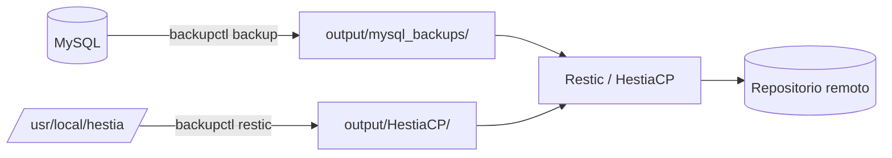

# Claves Restic de HestiaCP

!!! tip "¿Buscas cómo configurar Restic en HestiaCP?"
    Esta página trata de **volcar las claves** que ya existen. Para montar los
    respaldos incrementales desde cero —rclone, S3/Mega S4, retención, cron—
    ve a [Respaldos incrementales con Restic](../hestiacp/respaldos-incrementales.md).

HestiaCP guarda la clave de cada repositorio Restic en un `restic.conf` dentro
de su árbol de instalación. Esta orden los recopila en un único archivo.

```bash
sudo backupctl restic
```

## Por qué hace falta root

```bash
backupctl restic
# [ERROR] debe ejecutarse como root: sudo backupctl restic
```

Los `restic.conf` están bajo `/usr/local/hestia` con permisos restringidos. Sin
root, `find` no puede entrar en esos directorios y **produciría un archivo
vacío sin ningún error**: exactamente el tipo de fallo silencioso que este
sistema evita. Por eso se comprueba antes de empezar.

## Garantías

| Comprobación | Evita |
|---|---|
| Exige root | Un archivo vacío que parece válido |
| Aborta si no encuentra ningún `restic.conf` | Publicar un archivo sin contenido |
| Escribe en un temporal y publica al final | Que un fallo a mitad destruya el archivo del día anterior |
| `chown` al usuario del perfil | Que el archivo, creado por root, quede fuera del alcance del propio respaldo del usuario |

Ese último punto es sutil: el script corre como root pero el archivo vive en el
home del usuario. Sin el `chown`, el respaldo que HestiaCP hace de ese usuario
no podría incluirlo.

## Qué produce

```
output/HestiaCP/Restic_Configs_20260905.txt
```

```
# Claves de repositorio Restic de HestiaCP
# Servidor: servidor.example
# Generado: 2026-09-05 15:40:12 -05 por backupctl 2.0.0
# Repositorios: 4

=====================

# admin:
<contenido del restic.conf>

=====================
```

## Ver sin volcar

```bash
backupctl restic-list
```

```
USUARIO        ARCHIVO
admin          /usr/local/hestia/data/users/admin/restic.conf
cliente1    /usr/local/hestia/data/users/cliente1/restic.conf
```

## Cuándo ejecutarlo

**No va en cron.** Solo hace falta cuando cambian los repositorios: al dar de
alta un usuario nuevo, al reconfigurar el destino remoto o al rotar una clave.

## Retención

Se aplica `RESTIC_RETENTION_DAYS` (90 por defecto), conservando siempre los dos
más recientes.

## Cómo encaja con el resto

`backupctl` cubre la copia **local** de las bases de datos. Restic se lleva ese
directorio **fuera de la máquina**. Son capas distintas del mismo sistema:



Si pierdes el servidor entero, necesitas las claves de Restic para recuperar el
repositorio remoto — y esas claves están en el servidor. De ahí que este
volcado exista y que convenga guardarlo también en otro sitio.
