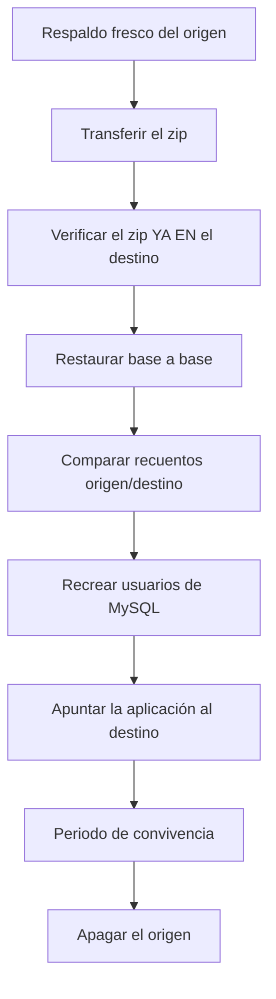

# 6. Migrar a otro servidor en serio

!!! danger "Esta guía ESCRIBE en las bases de datos del servidor destino"
    Haz primero **[5. Migrar — ensayo](migrar-ensayo.md)**.

## Plan general



**El origen no se apaga hasta el final.** Migrar no es mover: es copiar y luego,
cuando estás seguro, dejar de usar el viejo.

---

## Paso 1 — Migrar las bases de datos

Desde el **origen**:

```bash
ssh root@origen.example
cd /home/admin/scripts

./bin/backupctl migrate --to root@nuevo.example --fresh
```

!!! tip "`--fresh` casi siempre"
    Genera un respaldo nuevo justo antes de migrar, así viajan los datos de
    ahora mismo. Sin él se usa el último existente y te avisa de su antigüedad:

    ```
    [AVISO] tiene 3 días: los cambios posteriores NO se migrarán.
    ```

Pide confirmación explícita antes de escribir nada:

```
[AVISO] Esto va a ESCRIBIR en las bases de datos del servidor root@nuevo.example.
¿Continuar con la migración de 76 bases de datos? [s/N]
```

### Qué hace, en orden

1. Comprueba que el destino tiene `backupctl` con configuración válida.
2. Genera el respaldo en el origen (con `--fresh`).
3. Cuenta las tablas de cada base **en el origen**.
4. Transfiere el `.zip` con `rsync -azP` (reanudable si se corta).
5. **Verifica el zip ya en el destino** antes de restaurar nada.
6. Restaura base a base allí.
7. Cuenta las tablas **en el destino** y las compara.

### El resultado que importa

```
== Comprobación ==
BASE DE DATOS  ORIGEN  DESTINO  RESULTADO
tienda         41      41       ok
blog           22      22       ok
catalogo       18      18       ok

[INFO ] Restauradas: 76. Con fallos: 0. Recuentos que no cuadran: 0.
[  OK ] Migración completada y comprobada.
```

!!! danger "Si aparece `DIFIERE`"
    ```
    catalogo       18      12       DIFIERE
    ```
    Algo no se restauró. **No sigas.** Mira el detalle de esa base:

    ```bash
    ssh root@nuevo.example '/home/admin/scripts/bin/backupctl logs --errors'
    ```

    Y reintenta solo esa:

    ```bash
    ./bin/backupctl migrate --to root@nuevo.example --databases catalogo --fresh
    ```

## Paso 2 — Recrear los usuarios de MySQL

`migrate` mueve datos, **no** usuarios ni privilegios. En el **origen**:

```bash
mysql -N -e "SELECT CONCAT('SHOW GRANTS FOR ''',user,'''@''',host,''';')
             FROM mysql.user
             WHERE user NOT IN ('root','mysql.sys','mysql.session','debian-sys-maint');" \
  | mysql -N | sed 's/$/;/' > /tmp/grants.sql

cat /tmp/grants.sql
```

Revísalo, ajusta las contraseñas (los `GRANT` no las traen en claro) y aplícalo
en el **destino**:

```bash
scp /tmp/grants.sql root@nuevo.example:/tmp/
ssh root@nuevo.example 'mysql < /tmp/grants.sql'
```

!!! info "En HestiaCP hay atajo"
    Si las bases están dadas de alta en el panel, es más limpio recrearlas allí,
    que genera el usuario con sus permisos:

    ```bash
    sudo v-add-database admin tienda usuario contraseña
    ```

    Y luego migrar los datos encima con `backupctl`.

## Paso 3 — Llevarte el resto de la cuenta HestiaCP

Las bases de datos ya están. Faltan dominios, correo, archivos y SSL:

```bash
# En el ORIGEN
sudo v-backup-user admin
ls -lh /backup/

# Transferir
scp /backup/admin.*.tar root@nuevo.example:/backup/

# En el DESTINO
sudo v-restore-user admin admin.2026-09-05_03-10-01.tar
```

??? question "¿Y si `v-restore-user` restaura también las bases de datos?"
    Las sobrescribiría con las del `.tar`, que es de la hora del respaldo de
    HestiaCP y puede ser más antiguo. Por eso el orden recomendado es:

    1. `v-restore-user` primero (deja la cuenta completa montada)
    2. `backupctl migrate --fresh` después (pone los datos al día)

    Si ya migraste antes, repite el `migrate` tras el `v-restore-user`.

## Paso 4 — Comprobar el destino a fondo

```bash
ssh root@nuevo.example
cd /home/admin/scripts

./bin/backupctl doctor
./bin/backupctl backup
./bin/backupctl verify --restore-test tienda --with-data
```

!!! danger "El `--restore-test` no es opcional"
    Es lo que demuestra que el servidor nuevo puede respaldarse **y**
    restaurarse solo. Sin eso has movido datos, pero no has montado un sistema.

## Paso 5 — Programar el respaldo en el destino

```bash
sudo ./bin/backupctl cron --install
```

En HestiaCP esto registra los trabajos con `v-add-cron-job`, así que aparecen en
el panel y sobreviven a los rebuilds.

Y configura los avisos, apuntando a un **healthcheck distinto** del origen:

```bash
./bin/backupctl config --edit
./bin/backupctl notify-test
```

## Paso 6 — Apuntar la aplicación al destino

Cambia las credenciales de conexión en la aplicación (`wp-config.php`,
`.env`, etc.) y, cuando funcione, el DNS.

!!! tip "Baja el TTL con antelación"
    Un día antes, pon el TTL del registro en 300 segundos. Así el cambio se
    propaga en minutos y no en horas, y la ventana en la que unos usuarios ven
    el servidor viejo y otros el nuevo es corta.

## Paso 7 — Convivencia

**No apagues el origen.** Déjalo encendido y respaldando.

Durante los primeros días:

```bash
ssh root@nuevo.example '/home/admin/scripts/bin/backupctl status'
```

Y en tu equipo, deja constancia de ambos:

```bash
backupctl -p MiVPS    pull root@origen.example
backupctl -p VPSNuevo pull root@nuevo.example
git add MiVPS VPSNuevo
git commit -m "Migración de MiVPS a VPSNuevo"
```

## Paso 8 — Apagar el origen

Solo cuando **todo** esté marcado:

- [ ] El destino lleva al menos una semana respaldando solo, sin errores
- [ ] `verify --restore-test --with-data` pasa en el destino
- [ ] La aplicación funciona contra la base nueva
- [ ] Los recuentos cuadran en todas las bases
- [ ] El DNS apunta al destino y se ha propagado
- [ ] El correo llega al destino
- [ ] Restic/HestiaCP está configurado y ha hecho al menos un envío externo
- [ ] Tienes las claves Restic del destino (`sudo backupctl restic`)
- [ ] Has guardado un respaldo final del origen **fuera de ambos servidores**

```bash
# Respaldo final del origen, a tu equipo
ssh root@origen.example '/home/admin/scripts/bin/backupctl backup'
scp root@origen.example:/home/admin/scripts/output/mysql_backups/all_databases_*.zip ~/archivo/
backupctl -p MiVPS verify ~/archivo/all_databases_XXXX.zip
```

!!! warning "Guarda ese archivo mucho tiempo"
    Es tu último recurso si dentro de tres meses aparece que faltaba algo. Un
    VPS apagado no se puede consultar.

## Si algo va mal a media migración

Nada se ha perdido: **el origen sigue intacto**. `migrate` solo lee del origen y
escribe en el destino.

```bash
# Reintentar solo lo que falló
./bin/backupctl migrate --to root@nuevo.example --databases problematica --fresh

# O empezar de cero en el destino
ssh root@nuevo.example 'mysql -e "DROP DATABASE problematica;"'
./bin/backupctl migrate --to root@nuevo.example --databases problematica --fresh
```

Ver [Cuando algo falla](../guias/diagnostico.md).
